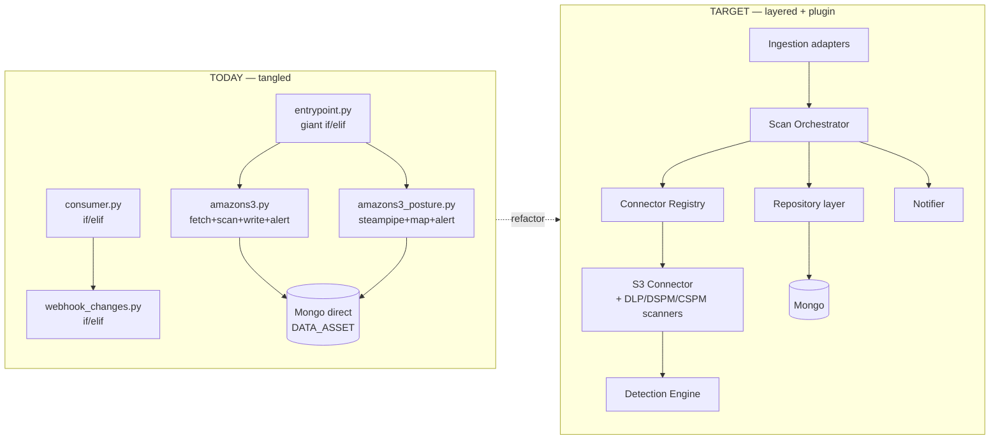
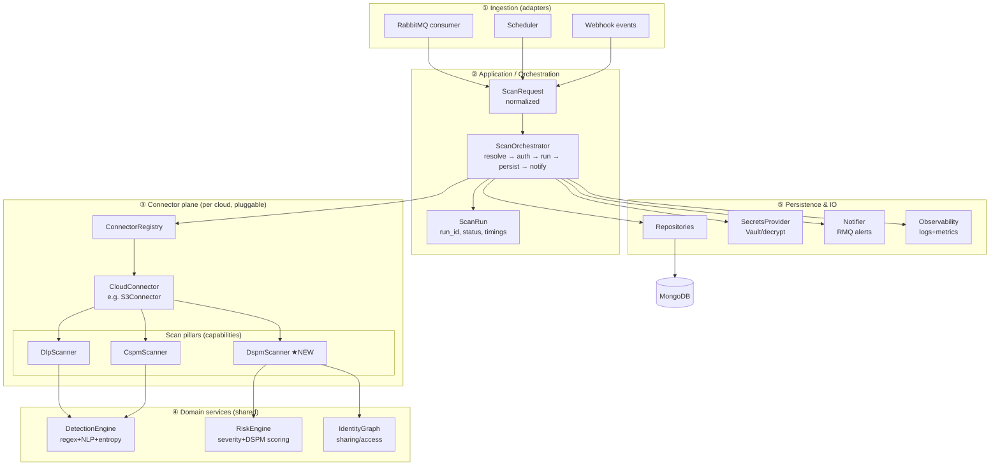
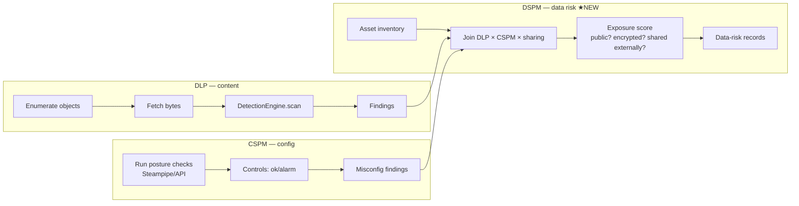
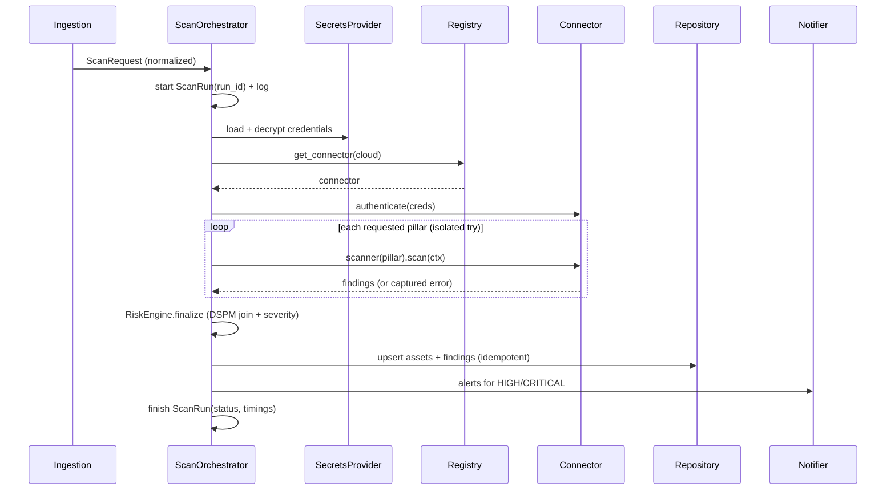
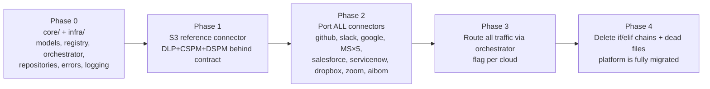

# Cloud Apps — Architecture Redesign

A proposed target architecture that (1) fully covers **DLP + DSPM + CSPM**, (2) makes the code
clean and easy to debug, and (3) is robust to partial failures. Designed platform-wide, with
**Amazon S3 as the reference connector**.

> Status: **design proposal**. Nothing here is wired in yet — see [Migration path](#8-migration-path).

---

## 1. Goals & non-goals

**Goals**
- One **plugin contract** every cloud implements → delete the `if/elif` dispatch chains.
- Three **explicit, composable scan pillars** — DLP, DSPM, CSPM — with a shared domain model.
- Close the **DSPM gap**: cross-reference *sensitive content* (DLP) × *exposure/config* (CSPM) × *access/sharing*.
- **Debuggability**: structured logging, per-scan run IDs, an error taxonomy, no silent `return False`.
- **Robustness**: per-stage error boundaries, retries + dead-letter, idempotent writes.
- A **repository layer** so business logic never touches Mongo directly.

**Scope: whole platform.** Every connector (S3, GitHub, Slack, Google, Microsoft ×5, Salesforce,
ServiceNow, Dropbox, Zoom, and the AIBOM/devops scanners) moves onto the same contract. S3 is the
**reference implementation** built first, but the target state is a fully migrated platform with the
old `if/elif` dispatch and dead files removed — see the [connector inventory](#8-connector-inventory-whole-platform)
and [migration path](#9-migration-path).

**Non-goals (for v1)**
- Rewriting the detection regex engine (it stays behind a `DetectionEngine` facade).
- Changing the RabbitMQ transport or Mongo as the store.

---

## 2. Current vs. target (at a glance)



---

## 3. Layered architecture



**Rule of dependencies:** arrows point downward only. Ingestion never imports connectors;
connectors never import Mongo; domain services never import transport. This is what makes it
testable and debuggable.

---

## 4. The three pillars, made explicit

Each connector declares which pillars it supports. A pillar is a small interface, not a monolith.



- **DLP** = what you already do in `amazons3.py` (`validate_sensitivity`), cleanly separated.
- **CSPM** = what `amazons3_posture.py` does (Steampipe benchmarks), behind the same contract.
- **DSPM (new)** = a *composition* layer: it reuses DLP findings + CSPM exposure + sharing/ACL
  to answer "where is sensitive data, and how exposed is it?" — the gap identified earlier.

### DSPM scoring example (S3)
```
data_risk = f(
    sensitivity        = max severity of DLP findings in the object/bucket,
    public_exposure    = CSPM control "S3 buckets should prohibit public read/write",
    encryption         = CSPM control "server-side encryption enabled",
    external_sharing   = ACL grants to non-owner / AllUsers (from get_file_information),
    identity_reach     = who/what principals can read it (IdentityGraph)
)
```
→ emits a `DataRiskRecord` per asset, e.g. *"Bucket X holds HIGH PII, is publicly readable and
unencrypted → CRITICAL data risk."* Nothing today produces this.

---

## 5. Core contracts (interfaces)

Concrete, small, and uniform. These replace `x_main()`, `S3BucketScanner`, `run_audit`, `_bp`.

```python
# core/models.py  — one shape everywhere
from dataclasses import dataclass, field
from enum import Enum

class Pillar(str, Enum):
    DLP = "dlp"; DSPM = "dspm"; CSPM = "cspm"

class Severity(str, Enum):
    UNKNOWN="unknown"; LOW="low"; MEDIUM="medium"; HIGH="high"; CRITICAL="critical"

@dataclass
class Asset:                      # a bucket, file, repo, drive item…
    id: str; kind: str; name: str; path: str
    account_name: str; namespace: str; cloud: str
    metadata: dict = field(default_factory=dict)

@dataclass
class Finding:                    # DLP match OR CSPM control OR DSPM risk — unified
    asset_id: str; pillar: Pillar; rule: str; category: str
    severity: Severity; count: int = 0
    entities: list = field(default_factory=list)
    location: list = field(default_factory=list)
    evidence: dict = field(default_factory=dict)

@dataclass
class ScanRequest:               # normalized from RMQ/scheduler/webhook
    namespace: str; cloud: str; account_name: str
    pillars: list                 # which pillars to run
    scan_time: int; trigger: str  # "scheduled" | "webhook" | "manual"
    target: dict = field(default_factory=dict)   # e.g. {bucket, key} for webhooks

@dataclass
class ScanResult:
    request: ScanRequest; run_id: str
    assets: list = field(default_factory=list)
    findings: list = field(default_factory=list)
    errors: list = field(default_factory=list)   # never swallowed — collected
```

```python
# core/contracts.py — the plugin contract
from typing import Protocol, Iterable

class Credentials(Protocol): ...          # opaque, from SecretsProvider

class PillarScanner(Protocol):
    pillar: Pillar
    def scan(self, ctx: "ScanContext") -> Iterable[Finding]: ...

class CloudConnector(Protocol):
    cloud: str                            # "amazonS3"
    supported_pillars: set                # {Pillar.DLP, Pillar.DSPM, Pillar.CSPM}
    def authenticate(self, creds: Credentials) -> None: ...
    def inventory(self, ctx: "ScanContext") -> Iterable[Asset]: ...
    def scanner(self, pillar: Pillar) -> PillarScanner: ...
```

```python
# core/registry.py — kills every if/elif chain
_REGISTRY: dict[str, type] = {}

def register(cloud: str):
    def deco(cls): _REGISTRY[cloud] = cls; return cls
    return deco

def get_connector(cloud: str) -> CloudConnector:
    if cloud not in _REGISTRY:
        raise UnknownConnector(cloud)     # explicit error, not silent False
    return _REGISTRY[cloud]()
```

Registration is a one-liner per connector:
```python
@register("amazonS3")
class S3Connector:
    cloud = "amazonS3"
    supported_pillars = {Pillar.DLP, Pillar.DSPM, Pillar.CSPM}
    ...
```

---

## 6. The orchestrator (single, uniform control flow)



Key properties that fix today's pain:
- **Each pillar runs in its own error boundary** — a CSPM/Steampipe failure never kills the DLP scan
  (today a bare `try/except` around the whole thing hides which part failed).
- **Errors are collected into `ScanResult.errors`**, logged with `run_id`, and surfaced — not
  swallowed by `return False`.
- **One place** decides severity, persistence, and alerting → no per-cloud drift.

---

## 7. Target folder structure

```
core/
  models.py            # Asset, Finding, ScanRequest/Result, Severity, Pillar
  contracts.py         # CloudConnector, PillarScanner protocols
  registry.py          # @register + get_connector
  orchestrator.py      # ScanOrchestrator (the sequence above)
  context.py           # ScanContext (creds, request, repos, logger, run_id)
  errors.py            # error taxonomy: UnknownConnector, AuthError, ScanError…

domain/
  detection/           # ← today's validate_sensitivity + hs.py + utils/*
    engine.py          # DetectionEngine facade
    patterns.py        # DEFAULT_REGEX etc. (from scripts/constants.py)
    scorers.py         # entropy, presidio, find_PI
  risk/
    risk_engine.py     # severity + DSPM exposure scoring
    identity_graph.py  # sharing/ACL → who-can-access

connectors/
  amazon_s3/
    connector.py       # @register("amazonS3") S3Connector
    dlp.py             # S3DlpScanner    (from amazons3.py fetch_sensitivity)
    dspm.py            # S3DspmScanner   (NEW)
    cspm.py            # S3CspmScanner   (from amazons3_posture.py)
    client.py          # boto3 wrapper (auth, list, get_object, ACL)
  github/ ...          # same shape — every connector in the inventory (§8)

infra/
  repositories.py      # AssetRepo, FindingRepo, ScanRunRepo (wrap DATA_ASSET)
  secrets.py           # SecretsProvider (Vault + MongoEncryptAndDecrypt)
  notifier.py          # RMQNotifier wrapper
  observability.py     # structured logger, metrics, run-id context

adapters/
  rmq_consumer.py      # replaces consumer.py — just builds ScanRequest → orchestrator
  scheduler.py         # replaces scheduler_main.py glue
  webhook.py           # replaces webhook_changes.py dispatch
  app.py               # Flask HTTP (thin)
```

**Delete after migration:** `amazons3_old.py`, `hs copy.py`, `validate_sensitivity_new.py`, and the
hardcoded `os.chdir(...)` in `consumer.py`.

---

## 8. Connector inventory (whole platform)

Every connector targets the same 3-pillar contract. This table is the platform-wide checklist —
what exists today, and what the redesign adds. **Every connector gains a DSPM pillar** (the gap).

| Connector | Today: DLP | Today: CSPM | DSPM today | Target connector folder | Pillars after |
|-----------|-----------|-------------|------------|--------------------------|---------------|
| Amazon S3 | `amazons3.py` | `amazons3_posture.py` | ✗ | `connectors/amazon_s3/` | DLP · **DSPM** · CSPM |
| GitHub | `github.py` | `github_posture.py` | ✗ | `connectors/github/` | DLP · **DSPM** · CSPM |
| Slack | `slack.py` | `slack_posture.py` | ✗ | `connectors/slack/` | DLP · **DSPM** · CSPM |
| Google Drive/WS | `googledrive.py` | `googleworkspace_posture.py` | ✗ | `connectors/google/` | DLP · **DSPM** · CSPM |
| MS OneDrive | `onedrive.py` | `microsoft_posture.py` | ✗ | `connectors/microsoft/onedrive.py` | DLP · **DSPM** · CSPM |
| MS Outlook | `outlook.py` (+ `outlook_ml.py`) | `microsoft_posture.py` | ✗ | `connectors/microsoft/outlook.py` | DLP · **DSPM** · CSPM |
| MS Teams | `msteams.py` | `microsoft_posture.py` | ✗ | `connectors/microsoft/msteams.py` | DLP · **DSPM** · CSPM |
| MS SharePoint | `sharepoint.py` | `microsoft_posture.py` | ✗ | `connectors/microsoft/sharepoint.py` | DLP · **DSPM** · CSPM |
| MS Entra/AzureAD | `azuread.py` | `microsoft_posture.py` | ✗ | `connectors/microsoft/azuread.py` | **DSPM** · CSPM (identity) |
| Salesforce | `salesforce.py` | `salesforce_posture.py` | ✗ | `connectors/salesforce/` | DLP · **DSPM** · CSPM |
| ServiceNow | `servicenow.py` | `servicenow_posture.py` | ✗ | `connectors/servicenow/` | DLP · **DSPM** · CSPM |
| Dropbox | `dropbox.py` | `dropbox_posture.py` | ✗ | `connectors/dropbox/` | DLP · **DSPM** · CSPM |
| Zoom | — (none) | `zoom_posture.py` | ✗ | `connectors/zoom/` | CSPM (+ DLP if recordings) |
| AIBOM — AWS/GCP/Azure | `aibom/devops/*` + `aibom/logs/*` | (BOM = inventory/posture) | ✗ | `connectors/aibom/*` | Inventory · CSPM · **DSPM** |

Notes:
- **Microsoft** connectors share one CSPM source (`microsoft_posture.py`) → in the target it becomes a
  shared `connectors/microsoft/cspm.py` reused by all five sub-assets.
- **Entra/AzureAD** feeds the `IdentityGraph` (who/what can access data) — the backbone of DSPM
  exposure scoring across the other Microsoft assets.
- **AIBOM** already produces CycloneDX inventories; it slots in as an `Inventory`+`CSPM` connector and
  its asset graph feeds DSPM (e.g. "this ML model/dataset holds sensitive data and is publicly reachable").

---

## 9. Migration path

Platform-wide cutover, sequenced so nothing breaks mid-flight. S3 is built first **as the reference**;
once the contract is proven, the remaining connectors are ported in parallel against it, then the old
dispatch and dead code are deleted platform-wide.



| Phase | Deliverable | Risk |
|-------|-------------|------|
| 0 | `core/`, `infra/repositories.py`, `core/errors.py`, structured logging — no behavior change | none (new code) |
| 1 | `connectors/amazon_s3/` (DLP+CSPM wrapped, **DSPM new**) — proves the contract end-to-end | low |
| 2 | Port every connector in the inventory to the contract (mechanical, one folder each, parallelizable) | medium |
| 3 | Adapters build `ScanRequest`; orchestrator routes each cloud (feature-flag per cloud during rollout) | medium |
| 4 | Remove `if/elif` in `entrypoint.py`/`consumer.py`/`webhook_changes.py`; delete `amazons3_old.py`, `hs copy.py`, `validate_sensitivity_new.py` | low (cleanup) |

Per-cloud feature flags mean old and new paths coexist until each connector is verified, so the
whole-platform migration lands incrementally without a big-bang risk.

---

## 10. How this maps your current files

| Today | Becomes |
|-------|---------|
| `entrypoint.py` if/elif | `core/orchestrator.py` + `core/registry.py` |
| `consumer.py` push_to_docker if/elif | `adapters/rmq_consumer.py` → `ScanRequest` |
| `webhook_changes.py` if/elif | `adapters/webhook.py` → `ScanRequest(trigger="webhook")` |
| `amazons3.py` `S3BucketScanner.fetch_sensitivity` | `connectors/amazon_s3/dlp.py` + `client.py` |
| `amazons3_posture.py` `amazonS3_bp` | `connectors/amazon_s3/cspm.py` |
| *(nothing)* | `connectors/amazon_s3/dspm.py` ★ |
| `validate_sensitivity.py`, `hs.py`, `utils/*` | `domain/detection/*` |
| `common.py` `severity_evaluation`, `insert_cloud_data` | `domain/risk/*` + `infra/repositories.py` |
| `common.py` `handle_exception` (swallow) | `core/errors.py` + `infra/observability.py` (collect + log w/ run_id) |
| direct `DATA_ASSET[...]` everywhere | `infra/repositories.py` |
| `vault.py` + `MongoEncryptAndDecrypt` | `infra/secrets.py` |

---

## 11. Debuggability & robustness checklist

- **Run IDs** — every scan gets a `run_id`; all logs/records carry it → trace one scan end-to-end.
- **Error taxonomy** (`core/errors.py`) — `AuthError`, `InventoryError`, `ScanError`, `PersistError`;
  each caught at its stage, attached to `ScanResult.errors`, never silently dropped.
- **Per-pillar isolation** — one pillar failing degrades gracefully (partial result) instead of aborting.
- **Idempotent writes** — repositories upsert by `(id, account_name, scan_time)` (you already do this
  in `insert_cloud_data`) → safe retries.
- **Dead-letter** — RMQ messages that fail after N retries go to a DLQ, not lost or infinitely looped.
- **Structured logs** — JSON logs with `run_id, cloud, account, pillar, stage, duration` replace
  scattered `print()` + `traceback.print_exc()`.
- **Testability** — connectors mock the cloud `client.py`; orchestrator tested with a fake connector;
  no network/Mongo needed for unit tests.

---

## 12. What you get

- Adding a new cloud = drop one folder in `connectors/`, no edits to orchestrator/consumer/webhook.
- **DSPM is a first-class pillar**, not an accident — the identified gap is closed for every connector.
- One finding shape → one severity path → one alerting path → consistent dashboards.
- A failing Steampipe run tells you *exactly* which control on which account failed, with a run_id.
- Dead code and hardcoded paths gone.
